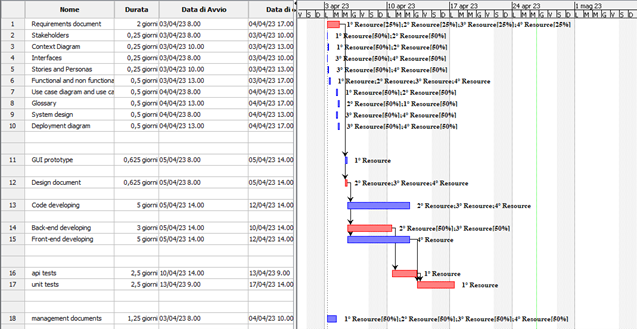

# Project Estimation - CURRENT
Date:

Version:

# Estimation approach
Consider the EZWallet  project in CURRENT version (as received by the teachers), assume that you are going to develop the project INDEPENDENT of the deadlines of the course
# Estimate by size
### 
|             | Estimate                        |             
| ----------- | :-------------------------------: |  
| NC =  Estimated number of classes to be developed   |                 15            |             
|  A = Estimated average size per class, in LOC       |            80                | 
| S = Estimated size of project, in LOC (= NC * A) | 1200 |
| E = Estimated effort, in person hours (here use productivity 10 LOC per person hour)  |               120                       |   
| C = Estimated cost, in euro (here use 1 person hour cost = 30 euro) | 3600 | 
| Estimated calendar time, in calendar weeks (Assume team of 4 people, 8 hours per day, 5 days per week ) |          1          |               

# Estimate by product decomposition
### 
|         component name    | Estimated effort (person hours)   |             
| ----------- | :-------------------------------: | 
|requirement document    | 16 |
| GUI prototype |5|
|design document | 15 |
|code | 120|
| unit tests |20|
| api tests |20|
| management documents  |10|

# Estimate by activity decomposition
### 
|         Activity name    | Estimated effort (person hours)   |             
| ----------- | :-------------------------------: | 
| Requirements document | 64 |
| Stakeholders | 4 |
| Context Diagram | 4 |
| Interfaces | 4 |
|Stories and personas | 4 |
|Funcitonal and non functional | 16 |
|Use case diagram and use cases| 8  |
|Glossary | 8 |
|System design | 8|
|Deployment diagram |8|
| GUI prototype | 5 |
|design document | 15 |
|  Code | 120 |
| Unit tests |20|
| Api tests |20|
| management documents  |10|
###

# Summary
Report here the results of the three estimation approaches. The  estimates may differ. 
Assuming team of 4 people, 8 hours per day, 5 days per week. The main reason for the higher duration of the first estimation with respect to the other two, is justified by the fact that in the first case we only consider the LOC. Considering 10 LOC per person hour, information on the time spent in the construction of the various documents is under estimated. In the second case, for the estimation by product decomposition, it's true that we give more effort in writing documents, but in the end, also in this case, the predition of time needed is under estimated. The tird an last estimation, the one made considering activity decomposition, is the one that is closer to the real time spent in this project because, thanks to the Gantt chart visualization, we can plot the activies based on the time spent.

|             | Estimated effort                        |   Estimated duration |          
| ----------- | ------------------------------- | ---------------|
| estimate by size |120 PH| 1 week
| estimate by product decomposition |196 PH| 1 week and 2 day
| estimate by activity decomposition |239 PH | 1 week and 3 days
