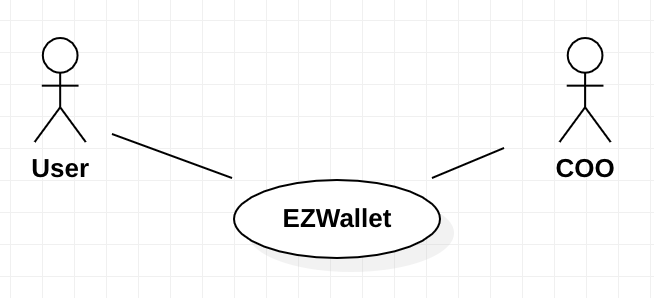
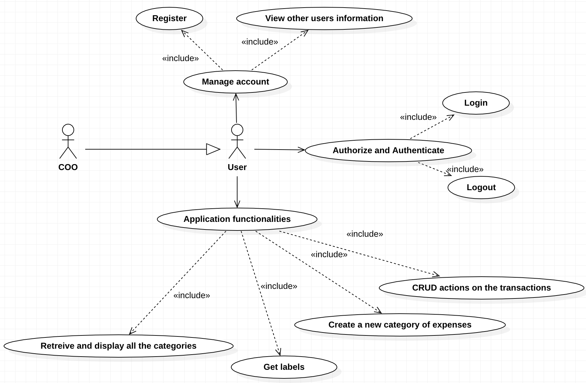
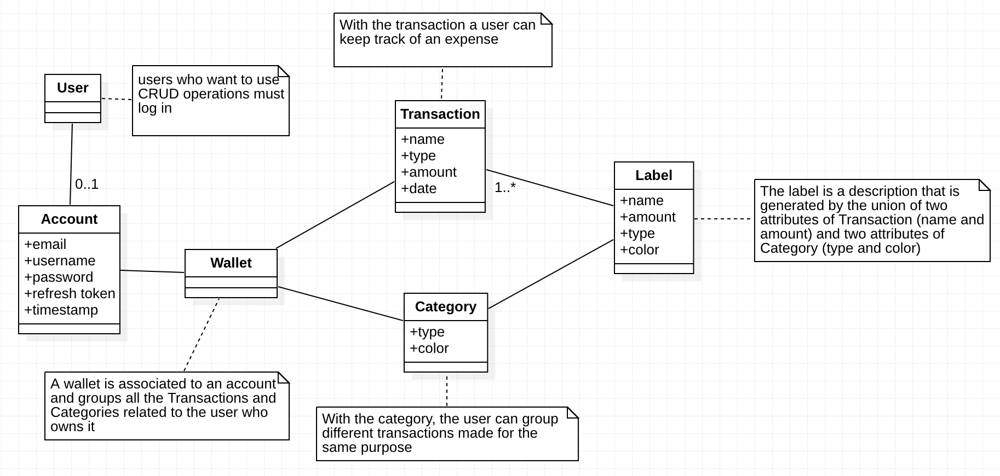
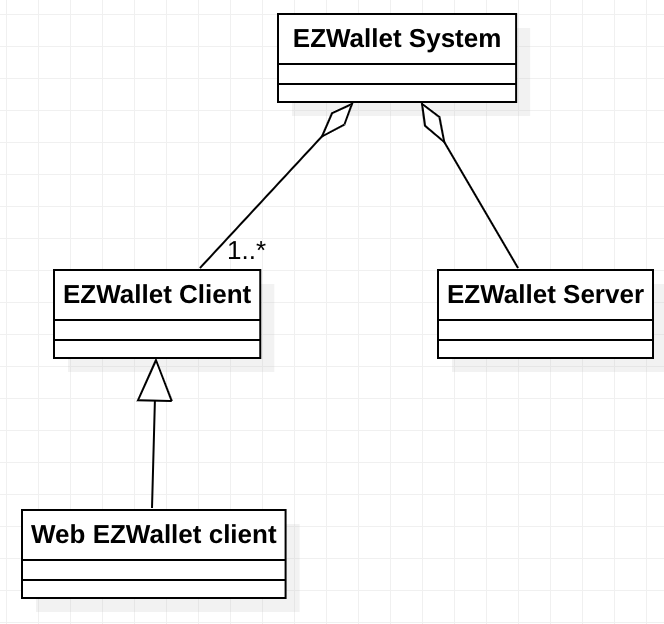
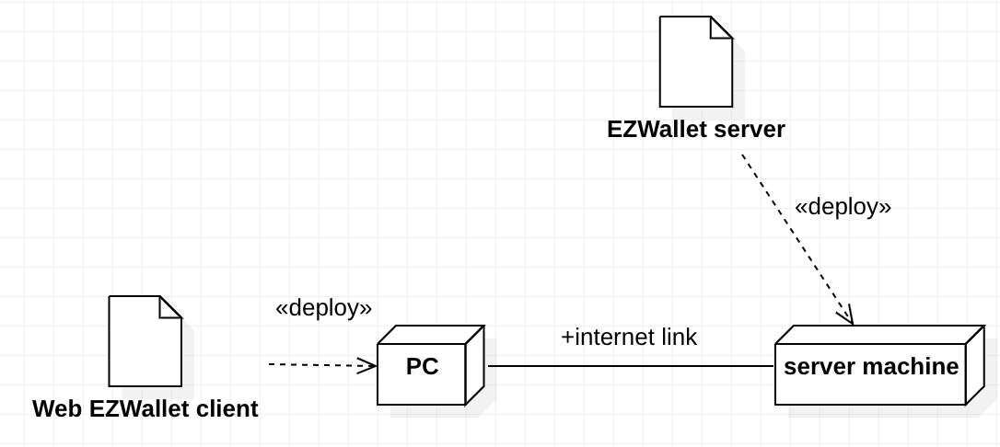

# Requirements Document - current EZWallet

Date: 2023/04/17

Version: V1 - description of EZWallet in CURRENT form (as received by teachers)

 
| Version number | Change |
| :-----------------: |:-----------:|
| V1.6 | 2023/04/25 | 

# Contents

- [Informal description](#informal-description)
- [Stakeholders](#stakeholders)
- [Context Diagram and interfaces](#context-diagram-and-interfaces)
	+ [Context Diagram](#context-diagram)
	+ [Interfaces](#interfaces) 
	
- [Stories and personas](#stories-and-personas)
- [Functional and non functional requirements](#functional-and-non-functional-requirements)
	+ [Functional Requirements](#functional-requirements)
	+ [Non functional requirements](#non-functional-requirements)
- [Use case diagram and use cases](#use-case-diagram-and-use-cases)
	+ [Use case diagram](#use-case-diagram)
	+ [Use cases](#use-cases)
    	+ [Relevant scenarios](#relevant-scenarios)
- [Glossary](#glossary)
- [System design](#system-design)
- [Deployment diagram](#deployment-diagram)

# Informal description
EZWallet (read EaSy Wallet) is a software application designed to help individuals and families keep track of their expenses. Users can enter and categorize their expenses, allowing them to quickly see where their money is going. EZWallet is a powerful tool for those looking to take control of their finances and make informed decisions about their spending.

# Stakeholders

| Stakeholder name  | Description | 
| ----------------- |:-----------:|
|   User    | A person who uses the application to manage his expenses| 
|   COO    | A worker whose goal is to administrate the evolution of the project|
|   Designer    | A worker whose goal is to design and create the GUI and the frontend part of the project|
|   Developer    | A worker whose goal is to develop the code of the project and manage the backend part |
|   Database    | A tool used to manage the data of the application, in this case it is MongoDB |

# Context Diagram and interfaces
## Context Diagram

## Interfaces

| Actor | Physical Interface | Logical Interface  |
| ------------- |:-------------:| -----:|
|   User   | Device (with browser), Internet connection | GUI  |
|   COO   | Device (with browser), Internet connection | Bash, Docker, Postman  |
|   Developer   | PC | GUI, WebStorm, VSCode, StarUML  |
|   Designer   | PC | Browser, StarUML, GUI Designer App  | 

# Stories and personas

### **Persona 1: student, female, 20 yo, no income**

#### Story 1:

A foreign student has moved in a new city to apply to the university. She doesn't have any time to work and the only form of income she receives is from her parents. They send her money every month to cover the house's expenses and, since the money are only the strictly necessary, she decides to use the EZWallet web application to keep track of the expenses and avoid the risk of remaining with some expenses uncovered and, if possible, dedicate some remaining money to personal purposes. Every month she discuss with her parents the situation in order to adjust it as soon as possible.
 

#### Story 2:

A student has moved into a new city in order to be nearer to the university she applied to. She has 2 roommates and they record any of their expenses made for the house or for the common needs on the virtual wallet to have the possibility to balance weekly. By doing so they avoid bad situations in which someone owes money to the others for a long period of time.
  

### **Persona 2: parent, young professional, 30 yo**

#### Story 1:

A recently formed family parent wants to reach a more stable financial situation. The need of organizing in the best way the resources leads to the choice of keeping track of all the expenses on the EZWallet web application. Doing so makes possible to analyze the habits and modify them in order to reach the goal set.

#### Story 2:
 
A young family parent wants to save money monthly in order to be able to cover important expected expenses such as a move or the care of a child.
This is made possible by keeping track of all the expenses and decide every-time what is appropriate to cut on in order to maximize the results.
  

### **Persona 3: parent with teenagers, entrepreneur, high income, self-made**
 
#### Story 1:

A parent wants to educate his growing teenagers on the matter of money management. This decision is supported by asking them to track the family expenses on a daily basis so that they can realize the importance of proper decisions.
  

### **Persona 4: young financial expert, works as financial consultant, medium income, do some stock exchanges as hobby**

#### Story 1:

A young financial expert has a good knowledge about the management of cash flows, so he decides to track the transactions performed in his investment activity in order to have an appropriate and precise report on the trend of his business. Since he uses different tools and applications to perform his trading, he decides to rely on a third-party wallet to have a general complete overview.

#### Story 2:

A young man who travels very much due to his work needs to keep track of his expenses in order to adapt to different situations quickly, he decides to use a web application such as EZWallet thanks to its portability such as the possibility to access it anytime from anywhere with any device.
  

### **Persona 5: man, middle aged, victim of a financial crisis**

#### Story 1:

A middle-aged man who loses his job due to the recession and the effect of a crisis need to quickly modify and adapt his habits in order to properly manage his resources during a possible unemployment period. He starts to keep track of the expenses in order to realize what is the forecasted period he can cover without any income also considering some unexpected expenses.

#### Story 2:
 
As an effect of the crisis a man notices that the cost of the life is constantly increasing so he decides to start keeping track of the expenses performed using the EZWallet application in order to construct an history and have the possibility to make comparisons with past months and directly organize his personal finance.
  

# Functional and non functional requirements

## Functional Requirements

| ID        | Description  | Table of rights |
| ------------- |:-------------:| :--------|
|  FR1 			| Manage account | User, COO, Developer |
|  FR1.1     	| Create an account | User, COO, Developer |
|  FR1.2		| Users logged as Admin can view information about all other users working on the same wallet | User |
|  FR1.3		| Logged users can view information about their own profile | User |
|  FR2 			| Authorize and Authenticate | User, COO, Developer |
|  FR2.1    	| Login to edit the local wallet | User |
|  FR2.1.1		| Login with registered email and password | User |
|  FR2.1.2		| Login can be bypassed if the actor has a valid refresh token | COO, Developer |
|  FR2.2		| Logout | User |
|  FR3			| Database management| COO, Developer, Database |
|  FR3.1		| Database saves a timestamp log | Database |
|  FR4 			| Application functionalities | User |
|  FR4.1 		| Create a new category of expenses | User |
|  FR4.2		| Retreive and display all the categories | User |
|  FR4.3 		| CRUD actions on the transactions | User |
|  FR4.4		| Get the labels where the transaction type is bound to a category | User |

## Non Functional Requirements

| ID        | Type (efficiency, reliability, ..)           | Description  |
| ------------- |:-------------:| :-----:|
|  NFR1     | Consistency  | The web application provides the same data if used from different devices or browsers |
|  NFR2     | Portability | The wallet must be accessible from any device supporting a web browser |  
|  NFR3     | Availability | Maximum downtime estimated: 1day/year |  
|  NFR4 	| Efficiency | All actions selected by the GUI must be completed in less than 100ms in order to preserve the user experience |  
|  NFR5		| Usability | Core functions for users should be used without training by users with at least 1 year experience with web applications |
|  NFR6		| Security | The application must require an authentication before it can be used |
|  NFR7		| Security | User's password must be encrypted by an hash function before being stored in the database | 

# Use case diagram and use cases

 
## Use case diagram

### Use case 1, UC1, **Sign up**
| Description      | Sign up|
| ------------- |:-------------:| 
|  Precondition     | User has no account |
|  Post condition     | User has an account |
|  Nominal Scenario     | The user enters his information to create a new account|
|  Variants     | /|
|  Exceptions     |User already registered|
#
| Scenario 1.1 | The user creates a new account |
| ------------- |:-------------:| 
|  Precondition     | User has no account |
|  Post condition     | User has an account |
| Step#        | Description  |
|  1     | User clicks the button to sign up |  
|  2     | System asks for username, email and password |
|  3     | User enters the information |
|  4     | System checks if the email is already in use |
|  5     | System stores account |
|  6     | System goes to the login page |
#

### Use case 2, UC2, **Login**
| Description        | Login |
| ------------- |:-------------:|
|  Precondition     | User has an account |
|  Post condition     | User is logged in |
|  Nominal Scenario     | The user enters his credentials to log in |
|  Variants     | /|
|  Exceptions     | Wrong password, user already logged in |
#
| Scenario 2.1 | The user logs in |
| ------------- |:-------------:|
|  Precondition     | User has an account |
|  Post condition     | User is logged in |
| Step#        | Description  |
|  1     | User clicks the button to log in |
|  2     | System asks for email and password |
|  3     | User enters the information |
|  4     | System checks if the user is already logged in |
|  5     | System checks if the user is not registered |
|  6     | System checks if the password is correct |
|  7     | System creates the access token |
|  8     | System creates the refresh token |
|  9     | System stores the refresh token |
|  10     | System sends the tokens to the client |
|  11     | System goes to the personal homepage |
#

### Use case 3, UC3, **Logout**
| Description        | Logout |
| ------------- |:-------------:|
|  Precondition     | User is logged in |
|  Post condition     | User is logged out |
|  Nominal Scenario     | The user logs out |
|  Variants     | / |
|  Exceptions     | User not found, user is already logged out|
#
| Scenario 3.1 | The user logs out |
| ------------- |:-------------:|
|  Precondition     | User is logged in |
|  Post condition     | User is logged out |
| Step#        | Description  |
| 1      | User clicks the profile button |
|  2     | User clicks the button to log out |
|  3     | System checks if the user is logged in controlling access token and refresh token|
|  4     | System searches the user using the refresh token |
|  5     | System deletes the refresh token and the access token |
|  6     | System saves the status of the logout |
|  7     | System goes to the login page |
#

### Use case 4, UC4, **View other users information**
| Description        |  View other users information|
| ------------- |:-------------:|
|  Precondition     | User must have admin privileges or must be logged in |
|  Post condition     | User sees other users information or his own information |
|  Nominal Scenario     | The user with admin privileges wants to see all users information, the user searches for his own information |
|  Variants     | Admin sees all users information, user sees his own information |
|  Exceptions     | User is not found, user is searching for other users information |
#
| Scenario 4.1 | User sees all users information |
| ------------- |:-------------:|
|  Precondition     | User must have admin privileges |
|  Post condition     | User sees all users information |
| Step#        | Description  |
|  1     | User uses the API getUsers via Postman |
|  2     | System checks if the user has admin privileges |
|  3     | System returns the information of all users |
#
| Scenario 4.2 | User searches for his own information |
| ------------- |:-------------:|
|  Precondition     | User must be logged in |
|  Post condition     | User sees his own information |
| Step#        | Description  |
|  1      | User clicks the profile button |
|  3     | System retrieves the logged user information to call the function |
|  4     | System checks if the user is logged in |
|  5     | System returns the information of the user |
#

### Use case 5, UC5, **Display categories**
| Description        | Display categories |
| ------------- |:-------------:|
|  Precondition     | User is logged in |
|  Post condition     | User sees all categories |
|  Nominal Scenario     | The user wants to see all categories |
|  Variants     | / |
|  Exceptions     | / |
#
| Scenario 5.1 | User sees all categories |
| ------------- |:-------------:|
|  Precondition     | User is logged in |
|  Post condition     | User sees all categories |
| Step#        | Description  |
|  1     | User clicks the button to add a new transaction |
|  2     | System checks if the user is logged in |
|  3     | System returns the information of all categories |
|  4	 | User can see all categories in a combo box |
#

### Use case 6, UC6, **Get labels**
| Description        | Get labels |
| ------------- |:-------------:|
|  Precondition     | User is logged in |
|  Post condition     | User sees all labels |
|  Nominal Scenario     | The user wants to see all labels |
|  Variants     |/ |
|  Exceptions     |/ |
#
| Scenario 6.1 | User sees all labels |
| ------------- |:-------------:|
|  Precondition     | User is logged in |
|  Post condition     | User sees all labels |
| Step#        | Description  |
|  1     | System checks if the user is logged in |
|  2     | System returns the information of all labels |
|  3     | User can see the labels in a pie chart called "Summary" |
#

### Use case 7, UC7, **Create a new category**
| Description        | Create a new category |
| ------------- |:-------------:|
|  Precondition     | User is logged in |
|  Post condition     | User creates the new category |
|  Nominal Scenario     | The user wants to create a new category |
|  Variants     | The user creates a new category, the user doesn't create a new category anymore |
|  Exceptions     | /|
#
| Scenario 7.1 | User can create a new category |
| ------------- |:-------------:|
|  Precondition     | User is logged in |
|  Post condition     | User creates the new category |
| Step#        | Description  |
|  1     | User clicks the button to create a new category |
|  2     | System asks for type and color of the category |
|  3     | User enters the type and the color |
|  4     | System checks if the user is logged in |
|  5     | System creates the new category |
|  6     | System goes to the create new transaction page |
#
| Scenario 7.2 | User doesn't create a new category anymore |
| ------------- |:-------------:|
|  Precondition     | User is logged in |
|  Post condition     | User doesn't create the new category |
| Step#        | Description  |
|  1     | User clicks the button to create a new category |
|  2     | System asks for type and color of the category |
|  3     | User clicks the button to go back |
|  4     | System goes to the create new transaction page |
#

### Use case 8, UC8, **CRUD actions on transactions**
| Description        |CRUD actions on transaction  |
| ------------- |:-------------:|
|  Precondition     | User is logged in |
|  Post condition     | User creates, reads, deletes transactions |
|  Nominal Scenario     | The user wants to create, read, delete transactions |
|  Variants     | User creates a new transactionm user reads a transaction, user deletes a transaction|
|  Exceptions     | /|
#
| Scenario 8.1 | User creates a new transaction |
| ------------- |:-------------:|
|  Precondition     | User is logged in |
|  Post condition     | User creates the new transaction |
|  Nominal Scenario     | The user wants to create a transaction |
|  Variants	 | User creates a new transaction, user creates a new transaction of a new type, user doesn't create a new transaction anymore |
|  Exceptions     | /|
#
| Scenario 8.1.1 | User creates a new transaction |
| ------------- |:-------------:|
|  Precondition     | User is logged in |
|  Post condition     | User creates the new transaction |
| Step#        | Description  |
|  1     | User clicks the button to create a new transaction |
|  2     | System asks for the name, amount, date and type of the transaction |
|  3     | User enters the name, amount, date and type of the transaction |
|  4     | System checks if the user is logged in |
|  5     | System creates the new transaction |
|  6     | System goes to the personal home page |
#
| Scenario 8.1.2 | User creates a new transaction of a new type |
| ------------- |:-------------:|
|  Precondition     | User is logged in |
|  Post condition     | User creates the new transaction of a new type |
| Step#        | Description  |
|  1     | User clicks the button to create a new transaction |
|  2     | System asks for the name, amount, date and type of the transaction |
|  3     | User enters the name, amount, date of the transaction |
|  4     | User clicks on the button to create a new category |
|  5     | System shows the create new category page |
#
| Scenario 8.1.3 | User doesn't create a new transaction anymore |
| ------------- |:-------------:|
|  Precondition     | User is logged in |
|  Post condition     | User doesn't create the new transaction anymore|
| Step#        | Description  |
|  1     | User clicks the button to create a new transaction |
|  2     | System asks for the name, amount, date and type of the transaction |
|  3     | User clicks the button to go back |
|  4     | System goes to the personal home page |
#
| Scenario 8.2 | User reads the transactions |
| ------------- |:-------------:|
|  Precondition     | User is logged in |
|  Post condition     | User reads the transactions |
|  Nominal Scenario     | The user wants to read all transactions |
| Variants	 | / |
|  Exceptions     | /|
#
| Scenario 8.2.1 | User reads the transactions |
| ------------- |:-------------:|
|  Precondition     | User is logged in |
|  Post condition     | User reads the transactions |
| Step#        | Description  |
|  1     | System checks if the user is logged in |
|  2     | System returns the transactions |
|  3	 | User can see the transactions thanks to a table in the personal home page |
#
| Scenario 8.3 | User deletes a transaction |
| ------------- |:-------------:|
|  Precondition     | User is logged in |
|  Post condition     | User deletes the transaction |
|  Nominal Scenario     | The user wants to delete a transaction |
|  Variants	 | User deletes a transaction, user deletes a transaction from the vertical GUI, user cancels the selection of the transactions to delete (vertical GUI only) |
|  Exceptions     | /|
#
| Scenario 8.3.1 | User deletes a transaction |
| ------------- |:-------------:|
|  Precondition     | User is logged in |
|  Post condition     | User deletes the transaction |
| Step#        | Description  |
|  1     | User clicks the button related to the transaction to delete |
|  2     | System retrieves the information of the transaction to delete  |
|  3     | System checks if the user is logged in |
|  4     | System deletes the transaction |
#
| Scenario 8.3.2 | User deletes a transaction from a mobile browser |
| ------------- |:-------------:|
|  Precondition     | User is logged in using a smartphone or vertical device |
|  Post condition     | User deletes the transaction |
| Step#        | Description  |
|  1     | User clicks the trash bin button |
|  2     | System allows user to select the transactions to delete |
|  3     | User selects the transaction(s) to delete |
|  4     | User clicks the button again to delete the transactions |
#
| Scenario 8.3.3 | User cancels the selection of the transactions to delete on a mobile browser |
| ------------- |:-------------:|
|  Precondition     | User is logged in using a smartphone or vertical device |
|  Post condition     | User cancels the selection of the transactions to delete |
| Step#        | Description  |	
|  1     | User clicks the trash bin button |
|  2     | System allows user to select the transactions to delete |
|  3     | User selects the transaction(s) to delete |
|  4     | User clicks the rollback button to abort the operation |
| 5     | System goes back to the personal home page |

# Glossary

#
# System Design

#
# Deployment Diagram
