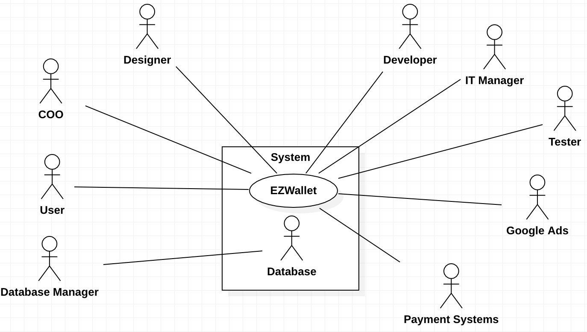
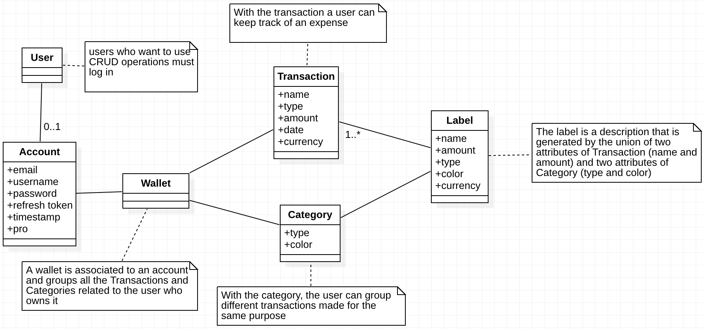
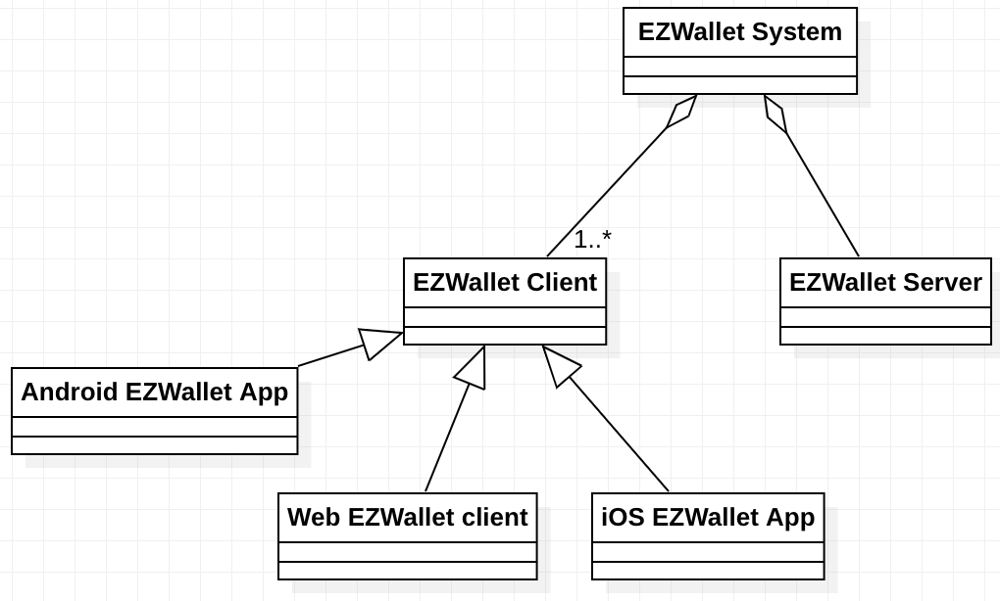
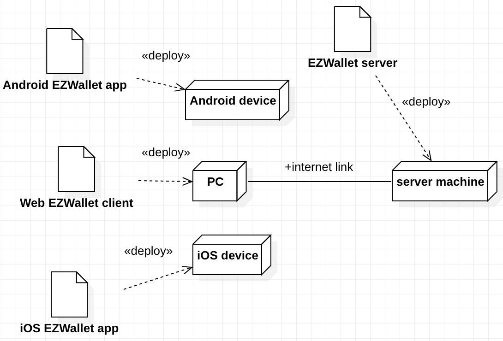

# Requirements Document - future EZWallet

Date: 

Version: V2 - description of EZWallet in FUTURE form (as proposed by the team)

 
| Version number | Change |
| :-----------------:|:-----------:|
| 2.0 | 25/04/2023 | 

# Contents

- [Informal description](#informal-description)
- [Stakeholders](#stakeholders)
- [Context Diagram and interfaces](#context-diagram-and-interfaces)
	+ [Context Diagram](#context-diagram)
	+ [Interfaces](#interfaces) 
	
- [Stories and personas](#stories-and-personas)
- [Functional and non functional requirements](#functional-and-non-functional-requirements)
	+ [Functional Requirements](#functional-requirements)
	+ [Non functional requirements](#non-functional-requirements)
- [Use case diagram and use cases](#use-case-diagram-and-use-cases)
	+ [Use case diagram](#use-case-diagram)
	+ [Use cases](#use-cases)
    	+ [Relevant scenarios](#relevant-scenarios)
- [Glossary](#glossary)
- [System design](#system-design)
- [Deployment diagram](#deployment-diagram)

# Informal description
EZWallet (read EaSy Wallet) is a software application designed to help individuals and families keep track of their expenses. Users can enter and categorize their expenses, allowing them to quickly see where their money is going. EZWallet is a powerful tool for those looking to take control of their finances and make informed decisions about their spending. The version 2 of the web application will be improved in functionalities and will integrate more services in orther to make the user experience more complete. The application will be accessible via the web browser

# Business model
The application is free to download and use, but it will contain non intrusive ads and some of the features will be limited (number of transactions, number of categories, number of currencies). The ads will be managed by Google Ads. Users can upgrade to a premium plan by paying for the EZWallet Pro account. The premium plan will remove the ads and unlock all the features of the application. The payments will be managed by some third party integrated services such as Google Pay, Apple Pay, PayPal, credit card number (Visa & Mastercard). 

# Stakeholders
| Stakeholder name  | Description | 
| ----------------- |:-----------:|
|   User    | A person who uses the application to manage his expenses| 
|   COO    | A worker whose goal is to administrate the evolution of the project|
|   Designer    | A worker whose goal is to design and create the GUI and the frontend part of the project|
|   Developer    | A worker whose goal is to develop the code of the project and manage the backend part |
|IT Manager | A worker whose goal is to manage the IT infrastructure of the project |
|   Tester    | A worker whose goal is to test the application and find bugs |
|   Database Manager    | A worker whose goal is to manage the database of the application |
|   Database    | A tool used to manage the data of the application, in this case it is MongoDB |
| Google Ads | A tool used to manage the ads of the application |
| Google Play and App Store | The stores where the application will be published |
| Google Pay, Apple Pay, PayPal, Credit Card | The payment methods that the application will use |

# Context Diagram and interfaces

## Context Diagram

## Interfaces

| Actor | Physical Interface | Logical Interface  |
| ------------- |:-------------:| :-----:|
|   User   | Device (with browser), App, Internet connection | GUI, Postman  |
|   COO   | Device (with browser), Internet connection | Bash, Docker, Postman, Google Ads Dashboard  |
|   Developer   | PC | GUI, WebStorm, VSCode, StarUML  |
|   Designer   | PC | Browser, StarUML, GUI Designer App  |
|   IT Manager   | PC | GUI, Bash, Docker, Postman  |
|   Tester   | PC | GUI, Bash, Docker, Postman  |
|   Database Manager   | PC | GUI, Bash, Docker, Postman, MongoDB Compass  |
| Google Ads| APIs | https://developers.google.com/google-ads/api/docs/start |
| Apple Pay | APIs | https://developer.apple.com/documentation/apple_pay_on_the_web/choosing_an_api_for_implementing_apple_pay_on_your_website |
| Google Pay | APIs | https://developers.google.com/pay/api/web/overview |
| PayPal | APIs | https://developer.paypal.com/docs/api/overview/ |
| Credit Card | APIs | https://stripe.com/docs/api |

# Stories and personas

### **Persona 1: student, female, 20 yo, no income**

#### Story 1:

She is a student and she has moved in a foreign city for university purposes. She doesn't have any time to work. Her source of income is a fixed amount of money, sent from her parents. With that money she has to pay the rent and the bills too so she decides to keep track of her expenses to make sure she doensn't overspend her money. With EZWallet she can avoid the risk of remaining with some expenses uncovered and, when possible, she can save some remainings for personal purposes.
 

#### Story 2:

She is a student and she moved moved to a new city to be closer to her university. She has two roommates. They decided to record all the expenses made for the house or for the common needs on a virtual wallet, using EZWallet, to have the possibility to have a clear view about who have to pay what. By doing so, they avoid bad situations in which someone owes money to the others for a long period of time.
  

### **Persona 2: single woman, 30yo, travels a lot for work**

#### Story 1:

A young woman who travels frequently in different countries due to business reasons. Her company asks to present a detailed report with the expenses to refund after every travel she made. She decides to create an EZWallet PRO account because of the unlimited recording features and the possibility to directly add transactions performed abroad using different currencies. This allows her to save time and effort in the process of creating the report.
 

### **Persona 3: parent with teenagers, entrepreneur, high income, self-made**
 
#### Story 1:

A parent wants to educate his growing teenagers on the matter of money management. This decision is supported by asking them to track the family expenses on a daily basis so that they can realize the importance of proper decisions. He decides to upgrade to the PRO version of the account after a little period trying the free version, in order to unlock the possibility of creating unlimited transactions and catergories and to achieve a more detailed tracking of their expenses.
  

### **Persona 4: young financial expert, works as financial consultant, medium income, do some stock exchanges as hobby**

#### Story 1:

A young financial expert has a good knowledge about the management of money flows, so he decides to track the transactions he performed in his investment activities in order to have an appropriate and precise report on the trend of his business. Since he uses different tools and applications to perform trading, he decides to rely on a third-party wallet to have a general complete overview and he chooses EZWallet.

#### Story 2:

A young man who often travels due to his work needs to keep track of his expenses in order to adapt to different situations quickly, he decides to use EZWallet due to its portability. He will access to the same account from different devices.
  

### **Persona 5: man, middle aged, victim of a financial crisis**

#### Story 1:

A middle-aged man who loses his job due to the recession and the effect of a crisis need to quickly modify and adapt his habits in order to properly manage his resources during a no-income period. He starts to keep track of his expenses using EZWallet in order to realise what is the forecasted period he can cover without any income including some unexpected expenses.

#### Story 2:
 
As an effect of the crisis, a man notices that the cost of life is constantly increasing, so he decides to start keeping track of his expenses using the EZWallet application in order to generate an expenses history and have the possibility to make comparisons with past months and directly organize his personal finance.
  

# Functional and non functional requirements

## Functional Requirements

| ID        | Description  | Table of rights |
| ------------- |:-------------:| :--------|
|  FR1 			| **Manage account** | User, COO, Developer |
|  FR1.1     	| Create an account | User, COO, Developer |
|  FR1.1.1		| Create a premium account | User |
|  FR1.1.1.1	| Create a premium account by paying with Google Pay service | User |
|  FR1.1.1.2	| Create a premium account by paying with Apple Pay service | User |
|  FR1.1.1.3	| Create a premium account by paying with PayPal service | User |
|  FR1.1.1.4	| Create a premium account by paying with Credit Card service | User |
|  FR1.1.2		| Create a free account | User, COO, Developer |
|  FR1.2		| Logged users can view information about their own account | User |
|  FR1.3		| Logged users can update their own account | User |
|  FR1.3.1		| Logged users can update their account password | User |
|  FR1.3.2		| Logged users can permanently delete their account | User |
|  FR1.4		| Users with PRO account can retreive their purchase | User with PRO account | 
|  FR1.5		| Users with a free account can upgrade to a PRO account | User |
|  FR2 			| **Authorize and Authenticate** | User, COO, Developer |
|  FR2.1    	| Login to edit the wallet | User |
|  FR2.1.1		| Login with registered email and password | User |
|  FR2.1.2		| Login with valid refresh token | User |
|  FR2.2		| Logout | User |
|  FR2.3		| Credentials recovery | User |
|  FR2.3.1		| Password recovery | User |
|  FR2.3.1.1	| Password recovery by email | User |
|  FR2.3.1.2	| Password recovery by username | User |
|  FR3			| **Database management**| COO, Developer, Database Manager, Tester, Database |
|  FR3.1		| Database saves a timestamp log | Database |
|  FR3.2		| CRUD actions on accounts | COO, Developer, Database Manager, Tester |
|  FR3.2.1		| Create a new account | User with Admin privileges |
|  FR3.2.2		| Read the information of an account | User with Admin privileges |
|  FR3.2.3		| Update the information of an account | User with Admin privileges |
|  FR3.2.4		| Delete an account | User with Admin privileges |
|  FR3.3		| Data backup | Database |
|  FR4 			| **Application functionalities** | User |
|  FR4.1 		| Free version functionalities | User |
|  FR4.1.1 		| CRUD actions on categories| User |
|  FR4.1.1.1	| Create a new category of expenses (max 5)| User |
|  FR4.1.2		| CRUD actions on the transactions| User |
|  FR4.1.2.1	| Create a new transaction (max 15 per month)| User |
|  FR4.1.2.2	| Possibility to choose only one currency| User |
|  FR4.1.3 		| Watch ADs to unlock temporary PRO features | User |
|  FR4.1.3.1	| Watch ADs to unlock one more category valid until the end of the month | User |
|  FR4.1.3.2	| Watch ADs to unlock five more transactions valid until the end of the month | User |
|  FR4.2		| Pro version functionalities| User with PRO account |
|  FR4.2.1 		| CRUD actions on categories| User with PRO account |
|  FR4.2.1.1	| Create a new category of expenses (unlimited)| User with PRO account |
|  FR4.2.2		| CRUD actions on the transactions| User with PRO account |
|  FR4.2.2.1	| Create a new transaction (unlimited)| User with PRO account |
|  FR4.2.2.2	| Possibility to choose unlimited different currencies| User with PRO account |
|  FR4.2.3		| Get the labels where the transaction type is bound to a category | User with PRO account |
|  FR4.2.4		| Get a per-currency report of the transactions | User with PRO account |
|  FR4.3 		| Common versions functionalities | User |
|  FR4.3.1 		| CRUD actions on categories| User |
|  FR4.3.1.1	| Read the information of a category of expenses | User |
|  FR4.3.1.2	| Update the information of a category of expenses | User |
|  FR4.3.1.3	| Delete a category of expenses | User |
|  FR4.3.2		| CRUD actions on the transactions| User |
|  FR4.3.2.1	| Read the information of a transaction | User |
|  FR4.3.2.2	| Update the information of a transaction | User |
|  FR4.3.2.3	| Delete a transaction | User |
|  FR4.3.3		| Filter transactions | User |
|  FR4.3.3.1	| Filter transactions by category | User |
|  FR4.3.3.2	| Filter transactions by date | User |
|  FR4.3.3.3	| Filter transactions by amount | User |
|  FR4.3.4		| Sort transactions | User |
|  FR4.3.4.1	| Sort transactions by category | User |
|  FR4.3.4.2	| Sort transactions by date | User |
|  FR4.3.4.3	| Sort transactions by amount | User |

## Non Functional Requirements

| ID        | Type (efficiency, reliability, ..)           | Description  |
| ------------- |:-------------:| :-----:|
|  NFR1     | Consistency  | The web application provides the same data if used from different devices or browsers |
|  NFR2     | Portability | The wallet must be accessible from any device supporting a web browser |  
|  NFR3     | Availability | Maximum downtime estimated: 1day/year |  
|  NFR4 	| Efficiency | All actions selected by the GUI must be completed in less than 100ms in order to preserve the user experience |  
|  NFR5		| Usability | Core functions for users should be used without training by users with at least 1 year experience with web applications |
|  NFR6		| Security | The application must require an authentication before it can be used |
|  NFR7		| Security | User's password must be encrypted by an hash function before being stored in the database | 
| NFR7.1 	| Security | The application must be compliant with the GDPR regulation in order to be used in the European Union |
| NFR 7.2	| Security | Password must be changed every three months |
| NFR8		| Accessibility| Based on WCACG (Web Content Accessibility Guidelines), it can be used by people with disabilities|
| NFR10     | Distribution | The application is widely distributed thanks to Google Play and Apple Store |

# Use case diagram and use cases

## Use case diagram

### Use case 1, UC1, **Sign up**
| Description|  User creates an account |
| ------------- |:-------------:| 
|  Precondition     | User has no account |
|  Post condition     | User has an account |
|  Nominal Scenario     | The user enters his information to create a new account |
|  Variants     | The user creates a free account, the user creates a PRO account|
|  Exceptions     |User already registered, invalid payment method|
#
| Scenario 1.1 | The user creates a new free account |
| ------------- |:-------------:| 
|  Precondition     | User has no account |
|  Post condition     | User has an account |
| Step#        | Description  |
|  1     | User clicks the button to sign up |  
|  2     | System asks for username, email, password, pro version |
|  3     | User enters the information |
|  4     | System checks if the email is already in use |
|  5     | System stores account |
|  6     | System goes to the login page |
#
| Scenario 1.2 | The user creates a new PRO account |
| ------------- |:-------------:|
|  Precondition     | User has no account |
|  Post condition     | User has a PRO account |
| Step#        | Description  |
|  1     | User clicks the button to sign up |
|  2     | System asks for username, email, password, pro version |
|  3     | User enters the information |
|  4     | System checks if the email is already in use |
|  5	 | System asks for preferred payment method |
|  6     | User enters the preferred payment method |
|  7	 | System redirects the user to the selected provider payment service page |
|  8     | System checks if the payment is valid |
|  9     | System stores account |
|  10    | System goes to the login page |

### Use case 2, UC2, **Login**
| Description| Login |
| ------------- |:-------------:|
|  Precondition     | User has an account |
|  Post condition     | User is logged in |
|  Nominal Scenario     | The user enters his credentials to log in |
|  Variants     | The credentials are recognised as a valid user, the credentials are from a privileged account |
|  Exceptions     | Wrong credentials, user already logged in |
#
| Scenario 2.1 | The user logs in as an unprivileged user |
| ------------- |:-------------:|
|  Precondition     | User has an account |
|  Post condition     | User is logged in |
| Step#        | Description  |
|  1     | User clicks the button to log in |
|  2     | System asks for email and password |
|  3     | User enters the information |
|  4     | System checks if the user is already logged in |
|  5     | System checks if the user is not registered |
|  6     | System checks if the credentials are from a privileged user |
|  7    | System checks if the password is correct |
|  8     | System creates the access token |
|  9     | System creates the refresh token |
|  10     | System stores the refresh token |
|  11     | System sends the access token to the client |
|  12     | System goes to the personal homepage |
#
| Scenario 2.2 | The user logs in as a privileged user (Admin)|
| ------------- |:-------------:|
|  Precondition     | User has an administrator account and logs in via the APIs using Postman |
|  Post condition     | User is logged in with Admin privileges |
| Step#        | Description  |
|  1     | User uses the proper method to log in directly invoking the correct API |
|  2     | System checks if the user is already logged in |
|  3     | System checks if the user is not registered |
|  4     | System checks if the credentials are from a privileged user |
|  5     | System checks if the password is correct |
|  6     | System creates the access token |
|  7     | System creates the refresh token |
|  8     | System stores the refresh token |
|  9     | System sends the access token to the client |
|  10    | System allows CRUD operations on all the users |
|  11	 | System unlocks all the limited features |

### Use case 3, UC3, **Logout**
| Description| Logout |
| ------------- |:-------------:|
|  Precondition     | User is logged in |
|  Post condition     | User is logged out |
|  Nominal Scenario     | The user logs out |
|  Variants     | / |
|  Exceptions     | User not found, user is already logged out|
#
| Scenario 3.1 | The user logs out |
| ------------- |:-------------:|
|  Precondition     | User is logged in |
|  Post condition     | User is logged out |
| Step#        | Description  |
| 1      | User clicks the profile button |
|  2     | User clicks the button to log out |
|  3     | System checks if the user is logged in controlling access token and refresh token|
|  4     | System searches the user using the refresh token |
|  5     | System deletes the refresh token and the access token |
|  6     | System saves the status of the logout |
|  7     | System goes to the login page |
#

### Use case 4, UC4, **View other users information**
| Description        | View other users information |
| ------------- |:-------------:|
|  Precondition     | User must have admin privileges or must be logged in |
|  Post condition     | User sees other users information or his own information |
|  Nominal Scenario     | The user with admin privileges wants to see all users information, the user searches for his own information |
|  Variants     | Admin sees all users information, user sees his own information |
|  Exceptions     | User is not found, user is searching for other users information |
#
| Scenario 4.1 | User sees all users information |
| ------------- |:-------------:|
|  Precondition     | User must have admin privileges |
|  Post condition     | User sees all users information |
| Step#        | Description  |
|  1     | User uses the API getUsers via Postman |
|  2     | System checks if the user has admin privileges |
|  3     | System returns the information of all users |
#
| Scenario 4.2 | User searches for his own information |
| ------------- |:-------------:|
|  Precondition     | User is logged in |
|  Post condition   | User sees his own information |
| Step#        | Description  |
|  1      | User clicks the profile button |
|  3     | System retrieves the logged user information to call the function |
|  4     | System checks if the user is logged in |
|  5     | System returns the information of the user |
#

### Use case 5, UC5, **Display categories**
| Description|  Display categories|
| ------------- |:-------------:|
|  Precondition     | User is logged in |
|  Post condition     | User sees all categories |
|  Nominal Scenario     | The user wants to see all categories |
|  Variants     | / |
|  Exceptions     | / |
#
| Scenario 5.1 | User sees all categories |
| ------------- |:-------------:|
|  Precondition     | User is logged in |
|  Post condition     | User sees all categories |
| Step#        | Description  |
|  1     | User clicks the button to add a new transaction |
|  2     | System checks if the user is logged in |
|  3     | System returns the information of all categories |
|  4	 | User can see all categories in a combo box |
#

### Use case 6, UC6, **Get labels**
| Description| Get labels |
| ------------- |:-------------:|
|  Precondition     | User is logged in |
|  Post condition     | User sees all labels |
|  Nominal Scenario     | The user wants to see all labels |
|  Variants     |/ |
|  Exceptions     |/ |
#
| Scenario 6.1 | User sees all labels |
| ------------- |:-------------:|
|  Precondition     | User is logged in |
|  Post condition     | User sees all labels |
| Step#        | Description  |
|  1     | System checks if the user is logged in |
|  2     | System returns the information of all labels |
|  3     | User can see the labels in a pie chart called "Summary" |
#

### Use case 7, UC7, **Create a new category**
| Description| Create a new category |
| ------------- |:-------------:|
|  Precondition     | User is logged in |
|  Post condition     | User creates the new category |
|  Nominal Scenario     | The user wants to create a new category |
|  Variants     | The user creates a new category, the user doesn't create a new category anymore, user can't create a new category due to limitations and the app randomly proposes an advertisement to temporarily unlock the feature |
|  Exceptions     | User has reached the maximum number of categories |
#
| Scenario 7.1 | User can creates a new category |
| ------------- |:-------------:|
|  Precondition     | User is logged in |
|  Post condition     | User creates the new category |
| Step#        | Description  |
|  1     | User clicks the button to create a new category |
|  2     | System asks for type and color of the category |
|  3     | User enters the type and the color |
|  4     | System checks if the user is logged in |
|  5	 | System checks if the user has reached the maximum number of categories |
|  6     | System creates the new category |
|  7     | System goes to the create new transaction page |
#
| Scenario 7.2 | User doesn't create a new category anymore |
| ------------- |:-------------:|
|  Precondition     | User is logged in |
|  Post condition     | User doesn't create the new category |
| Step#        | Description  |
|  1     | User clicks the button to create a new category |
|  2     | System asks for type and color of the category |
|  3     | User clicks the button to go back |
|  4     | System goes to the create new transaction page |
#
| Scenario 7.3 | User can't create a new category due to limitations and the app randomly proposes an advertisement to temporarily unlock the feature |
| ------------- |:-------------:|
|  Precondition     | User is logged in |
|  Post condition     | User create the new category |
| Step#        | Description  |
|  1     | User clicks the button to create a new category |
|  2     | System asks for type and color of the category |
|  3     | User enters the type and the color |
|  4     | System checks if the user is logged in |
|  5	 | System checks if the user has reached the maximum number of categories |
|  6     | System proposes the user to watch ad advertisement in order to unlock 1 more category for a limited period of time |
|  7     | User clicks the button to watch the ad |
|  8     | System shows the ad based on Google Ads service |
|  9     | User clicks the button to go back |
|  10    | System goes to the create new transaction page |
|  11    | System creates the new category |
|  12    | System goes to the create new transaction page |

### Use case 8, UC8, **CRUD actions on transactions**
| Description|CRUD actions on transactions  |
| ------------- |:-------------:|
|  Precondition     | User is logged in |
|  Post condition     | User creates, reads, deletes transactions |
|  Nominal Scenario     | The user wants to create, read, delete transactions |
|  Variants     | User creates a new transaction, user reads a transaction, user deletes a transaction|
|  Exceptions     | / |
#
| Scenario 8.1 | User creates a new transaction |
| ------------- |:-------------:|
|  Precondition     | User is logged in |
|  Post condition     | User creates the new transaction |
|  Nominal Scenario     | The user wants to create a transaction |
|  Variants	 | User creates a new transaction, user creates a new transaction of a new type, user doesn't create a new transaction anymore, user can't create a new category due to limitations and the app randomly proposes an advertisement to temporarily unlock the feature |
|  Exceptions     | User has reached the maximum number of transactions per month |
#
| Scenario 8.1.1 | User creates a new transaction |
| ------------- |:-------------:|
|  Precondition     | User is logged in |
|  Post condition     | User creates the new transaction |
| Step#        | Description  |
|  1     | User clicks the button to create a new transaction |
|  2     | System asks for the name, amount, date and type of the transaction |
|  3     | User enters the name, amount, date and type of the transaction |
|  4     | System checks if the user is logged in |
|  5	 | System checks if the user has reached the maximum number of transactions per month |
|  6     | System creates the new transaction |
|  7     | System goes to the personal home page |
#
| Scenario 8.1.2 | User creates a new transaction of a new type |
| ------------- |:-------------:|
|  Precondition     | User is logged in |
|  Post condition     | User creates the new transaction of a new type |
| Step#        | Description  |
|  1     | User clicks the button to create a new transaction |
|  2     | System asks for the name, amount, date and type of the transaction |
|  3     | User enters the name, amount, date of the transaction |
|  4     | User clicks on the button to create a new category |
|  5     | System shows the create new category page |
#
| Scenario 8.1.3 | User doesn't create a new transaction anymore |
| ------------- |:-------------:|
|  Precondition     | User is logged in |
|  Post condition     | User doesn't create the new transaction anymore|
| Step#        | Description  |
|  1     | User clicks the button to create a new transaction |
|  2     | System asks for the name, amount, date and type of the transaction |
|  3     | User clicks the button to go back |
|  4     | System goes to the personal home page |
#
| Scenario 8.1.4 | User can't create a new transaction due to limitations and the app randomly proposes an advertisement to temporarily unlock the feature |
| ------------- |:-------------:|
|  Precondition     | User is logged in |
|  Post condition     | User create the new transaction |
| Step#        | Description  |
|  1     | User clicks the button to create a new transaction |
|  2     | System asks for the name, amount, date and type of the transaction |
|  3     | User enters the name, amount, date and type of the transaction |
|  4     | System checks if the user is logged in |
|  5	 | System checks if the user has reached the maximum number of transactions per month |
|  6     | System proposes the user to watch ad advertisement in order to unlock 1 more transaction for a limited period of time |
|  7     | User clicks the button to watch the ad |
|  8     | System shows the ad based on Google Ads service |
|  9     | User clicks the button to go back |
| 10     | System creates the new transaction |
| 11     | System goes to the personal home page |
#
| Scenario 8.2 | User reads the transactions |
| ------------- |:-------------:|
|  Precondition     | User is logged in |
|  Post condition     | User reads the the transactions |
|  Nominal Scenario     | The user wants to review all the transactions |
|  Variants	 | The user wants to review all the transactions, the user wants to apply some filters, the user wants to sort the displayd transactions |
|  Exceptions     | / |
#
| Scenario 8.2.1 | User reads the transactions |
| ------------- |:-------------:|
|  Precondition     | User is logged in |
|  Post condition     | User reads the transactions |
| Step#        | Description  |
|  1     | System checks if the user is logged in |
|  2     | System returns the transactions |
|  3	 | User can see all the transactions thanks to a table in the personal home page |
#
| Scenario 8.2.2 | User applies some filters to modify the table of the transactions |
| ------------- |:-------------:|
|  Precondition     | User is logged in |
|  Post condition     | User modifies the table of the transactions |
| Step#        | Description  |
| 1   	| System checks if the user is logged in |
| 2   	| System returns the transactions |
| 3		| User can see all the transactions thanks to a table in the personal home page |
| 4		| User writes in the search field to apply filters |
| 5		| System applies the filters to the table of the transactions |
| 6		| System updates the table |
#
| Scenario 8.2.3 | User sorts the displayed transactions based on different criteria |
| ------------- |:-------------:|
|  Precondition     | User is logged in |
|  Post condition     | User modifies the table of the transactions |
| Step#        | Description  |
| 1   	| System checks if the user is logged in |
| 2   	| System returns the transactions |
| 3		| User can see all the transactions thanks to a table in the personal home page |
| 4		| User clicks on the button to sort the transactions |
| 5		| Users from the sorting criteria the one to apply |
| 6		| System applies the sorting criteria to the table of the transactions |
| 7		| System updates the table |
#
| Scenario 8.3 | User deletes a transaction |
| ------------- |:-------------:|
|  Precondition     | User is logged in |
|  Post condition     | User deletes the transaction |
|  Nominal Scenario     | The user wants to delete a transaction |
|  Variants	 | User deletes a transaction, user deletes a transaction from the vertical GUI, user cancels the selection of the transactions to delete (vertical GUI only) |
|  Exceptions     | /|
#
| Scenario 8.3.1 | User deletes a transaction |
| ------------- |:-------------:|
|  Precondition     | User is logged in |
|  Post condition     | User deletes the transaction |
| Step#        | Description  |
|  1     | User clicks the button related to the transaction to delete |
|  2     | System retrieves the information of the transaction to delete  |
|  3     | System checks if the user is logged in |
|  4     | System deletes the transaction |
#
| Scenario 8.3.2 | User deletes a transaction from a mobile browser |
| ------------- |:-------------:|
|  Precondition     | User is logged in using a smartphone or vertical device |
|  Post condition     | User deletes the transaction |
| Step#        | Description  |
|  1     | User clicks the trash bin button |
|  2     | System allows user to select the transactions to delete |
|  3     | User selects the transaction(s) to delete |
|  4     | User clicks the button again to delete the transactions |
#
| Scenario 8.3.3 | User cancels the selection of the transactions to delete on a mobile browser |
| ------------- |:-------------:|
|  Precondition     | User is logged in using a smartphone or vertical device |
|  Post condition     | User cancels the selection of the transactions to delete |
| Step#        | Description  |	
|  1     | User clicks the trash bin button |
|  2     | System allows user to select the transactions to delete |
|  3     | User selects the transaction(s) to delete |
|  4     | User clicks the rollback button to abort the operation |
| 5     | System goes back to the personal home page |
#
### Use Case 9, UC9, **Credentials Recovery**
| Description | Credentials Recovery|
| ------------- |:-------------:|
|  Precondition     | User has an account |
|  Post condition     | User gets a new temporary password to login with |
|  Nominal Scenario     | The user can't remember the password associated to the e-mail used to sign up |
|  Variants     | User gets a new temporary password to login with, user aborts the credentials reset |
|  Exceptions     | User not found |
#
| Scenario 9.1 | User gets a new temporary password via email to login with |
| ------------- |:-------------:|
|  Precondition     | User has an account |
|  Post condition     | User gets a new temporary password to login with |
| Step#        | Description  |
|  1     | User clicks the forgotten password button|
|  2     | System asks for the e-mail address or username associated to the account |
|  3     | User enters the e-mail address or the username associated to the account |
|  4	 | User clicks the button to continue |
|  5     | System checks if the e-mail address or username is valid |
|  6	 | System sends the temporary password to the e-mail address of the user |
|  7     | System goes to the login page |
#
| Scenario 9.2 | User aborts the credentials reset |
| ------------- |:-------------:|
|  Precondition     | User has an account |
|  Post condition     | User aborts the credentials reset |
| Step#        | Description  |
|  1     | User clicks the forgotten password button|
|  2     | System asks for the e-mail address or username associated to the account|
|  3     | User enters the e-mail address or the username associated to the account|
|  4	 | User clicks the button to go back to the login page |
|  5     | System goes to the login page |
#

### Use Case 10, UC10, **Account password update**
| Description |Account password update |
| ------------- |:-------------:|
|  Precondition     | User is logged in |
|  Post condition     | User updates the account password |
| Nominal Scenario     | The user wants to update the account password |
| Variants     | User updates the account password, user aborts the update action |
| Exceptions     | Password already set |
#
| Scenario 10.1 | User updates the account password |
| ------------- |:-------------:|
|  Precondition     | User is logged in |
|  Post condition     | User updates the account password |
| Step#        | Description  |
| 1     | User clicks the profile button |
| 2     | System retrieves the information of the user |
| 3     | System checks if the user is logged in |
| 4	    | System returns the information of the user |
| 5     | User clicks the button to update the password |
| 6     | System asks for the old password |
| 7     | User enters the old password |
| 8     | System asks for the new password |
| 9	 	| System asks for the new password confirmation |
| 10    | User enters the new password and confirms it |
| 11    | System checks if the new password is valid and matches the confirmation|
| 12    | System updates the password |
| 13    | System goes back to the personal home page |
#
| Scenario 10.2 | User aborts the update action |
| ------------- |:-------------:|
|  Precondition     | User is logged in |
|  Post condition     | User aborts the update action |
| Step#        | Description  |
| 1     | User clicks the profile button |
| 2     | System retrieves the information of the user |
| 3     | System checks if the user is logged in |
| 4	    | System returns the information of the user |
| 5     | User clicks the button to update the password |
| 6     | System asks for the old password |
| 7     | User enters the old password |
| 8     | System asks for the new password |
| 9	 	| User clicks the button to go back to the personal home page |
| 10    | System goes back to the personal home page and leaves the password unchanged |
#
### Use Case 11, UC11, **Account deletion**
| Description |Account deletion |
| ------------- |:-------------:|
|  Precondition     | User is logged in |
|  Post condition     | User deletes the account |
| Nominal Scenario     | The user wants to delete the account |
| Variants     | User deletes the account, user aborts the deletion action |
| Exceptions   | / |
#
| Scenario 11.1 | User deletes the account |
| ------------- |:-------------:|
|  Precondition     | User is logged in |
|  Post condition     | User deletes the account |
| Step#        | Description  |
| 1     | User clicks the profile button |
| 2     | System retrieves the information of the user |
| 3     | System checks if the user is logged in |
| 4	    | System returns the information of the user |
| 5     | User clicks the button to delete the account |
| 6     | System asks for a confirmation |
| 7     | User clicks the confirm button |
| 8     | System deletes the account |
| 9     | System goes back to the login page |
#
| Scenario 11.2 | User aborts the deletion action |
| ------------- |:-------------:|
|  Precondition     | User is logged in |
|  Post condition     | User aborts the deletion action |
| Step#        | Description  |
| 1     | User clicks the profile button |
| 2     | System retrieves the information of the user |
| 3     | System checks if the user is logged in |
| 4	    | System returns the information of the user |
| 5     | User clicks the button to delete the account |
| 6     | System asks for a confirmation |
| 7     | User clicks the cancel button |
| 8	 	| System goes back to the profile information page |
#
### Use Case 12, UC12, **PRO version - Create a new Category**
| Description| PRO version - Create a new Category |
| ------------- |:-------------:|
|  Precondition     | User is logged in a PRO account |
|  Post condition     | User creates the new category |
|  Nominal Scenario     | The user wants to create a new category |
|  Variants     | The user creates a new category, the user doesn't create a new category anymore|
|  Exceptions     | / |
#
| Scenario 12.1 | User can creates a new category |
| ------------- |:-------------:|
|  Precondition     | User is logged in |
|  Post condition     | User creates the new category |
| Step#        | Description  |
|  1     | User clicks the button to create a new category |
|  2     | System asks for type and color of the category |
|  3     | User enters the type and the color |
|  4     | System checks if the user is logged in |
|  6     | System creates the new category |
|  7     | System goes to the create new transaction page |
#
| Scenario 12.2 | User doesn't create a new category anymore |
| ------------- |:-------------:|
|  Precondition     | User is logged in |
|  Post condition     | User doesn't create the new category |
| Step#        | Description  |
|  1     | User clicks the button to create a new category |
|  2     | System asks for type and color of the category |
|  3     | User clicks the button to go back |
|  4     | System goes to the create new transaction page |
#
### Use Case 13, UC13, **PRO version - Create a new transaction**
#
| Scenario 13.1 | User creates a new transaction |
| ------------- |:-------------:|
|  Precondition     | User is logged in a PRO account|
|  Post condition     | User creates the new transaction |
|  Nominal Scenario     | The user wants to create a transaction |
|  Variants	 | User creates a new transaction, user creates a new transaction of a new type, user doesn't create a new transaction anymore|
|  Exceptions     | / |
#
| Scenario 13.1.1 | User creates a new transaction |
| ------------- |:-------------:|
|  Precondition     | User is logged in |
|  Post condition     | User creates the new transaction |
| Step#        | Description  |
|  1     | User clicks the button to create a new transaction |
|  2     | System asks for the name, amount, date and type of the transaction |
|  3     | User enters the name, amount, date and type of the transaction |
|  4     | System checks if the user is logged in |
|  5     | System creates the new transaction |
|  6     | System goes to the personal home page |
#
| Scenario 13.1.2 | User creates a new transaction of a new type |
| ------------- |:-------------:|
|  Precondition     | User is logged in |
|  Post condition     | User creates the new transaction of a new type |
| Step#        | Description  |
|  1     | User clicks the button to create a new transaction |
|  2     | System asks for the name, amount, date, type and currency (if more than one are active on the same wallet) of the transaction |
|  3     | User enters the name, amount, date and currency of the transaction |
|  4     | User clicks on the button to create a new category |
|  5     | System shows the create new category page |
#
| Scenario 13.1.3 | User doesn't create a new transaction anymore |
| ------------- |:-------------:|
|  Precondition     | User is logged in |
|  Post condition     | User doesn't create the new transaction anymore|
| Step#        | Description  |
|  1     | User clicks the button to create a new transaction |
|  2     | System asks for the name, amount, date, type and currency (if more than one are active on the same wallet) of the transaction |
|  3     | User clicks the button to go back |
|  4     | System goes to the personal home page |
#
### Use Case 14, UC14, **PRO version - Add a new Currency**
#
| Description |PRO version - Add a new Currency |
| ------------- |:-------------:|
|  Precondition     | User is logged in a PRO account |
|  Post condition     | User can select the currency for each transaction registered |
|  Nominal Scenario     | The user wants to add a new currency |
|  Variants   | / |
|  Exceptions     | / |
#
| Scenario 14.1 | User adds a new currency |
| ------------- |:-------------:|
|  Precondition     | User is logged in |
|  Post condition     | User adds a new currency |
| Step#        | Description  |
|  1     | User clicks the button to add a new trasnaction |
|  2     | System asks for the name, amount, date, type and currency (if more than one are active on the same wallet) of the transaction |
|  3     | User selects the currency combo box and writes a new currency|
|  4     | System checks if the user is logged in |
|  5     | System creates the new transaction |
|  6     | System goes to the personal home page |
#
### Use Case 15, UC15, **PRO version - Get a per currency transactions report**
| Description|  |
| ------------- |:-------------:|
|  Precondition     | User is logged in a PRO account|
|  Post condition     | User sees all the transactions grouped by currency |
|  Nominal Scenario     | The user wants to see the transaction performed in each currency activated on the wallet |
|  Variants     |/ |
|  Exceptions     |/ |
#
| Scenario 6.1 | User sees all labels |
| ------------- |:-------------:|
|  Precondition     | User is logged in |
|  Post condition     | User sees all labels |
| Step#        | Description  |
| 1 	 | User clicks on the download report icon|
| 2     | System checks if the user is logged in |
| 3      | System asks the confirmation to download the report|
| 4      | System sends the report to the download folder of the user |
#
### Use Case 16, UC16, **Account upgrade to PRO version**
| Description|  |
| ------------- |:-------------:|
|  Precondition     | User is logged in a FREE account|
|  Post condition     | User upgrades the account to PRO version |
|  Nominal Scenario     | The user wants to upgrade the account to PRO version |
|  Variants     | / |
|  Exceptions     | / |
#
| Scenario 16.1 | User upgrades the account to PRO version |
| ------------- |:-------------:|
|  Precondition     | User is logged in |
|  Post condition     | User upgrades the account to PRO version |
| Step#        | Description  |
|  1     | User clicks the profile button |
|  2     | System retrieves the information of the user |
|  3     | System checks if the user is logged in |
|  4     | System returns the information of the user |
|  5     | User clicks the button to upgrade the account to the PRO version|
|  6  	 | System asks the user the preferred payment method |
|  7     | User enters the preferred payment method |
|  6	 | System takes the user to the payment service provider page |
|  7     | User enters the payment information |
|  8     | System checks if the payment is valid |
|  9     | System updates the account |
|  10    | System goes to the login page |
#
# Glossary

# System Design

# Deployment Diagram
