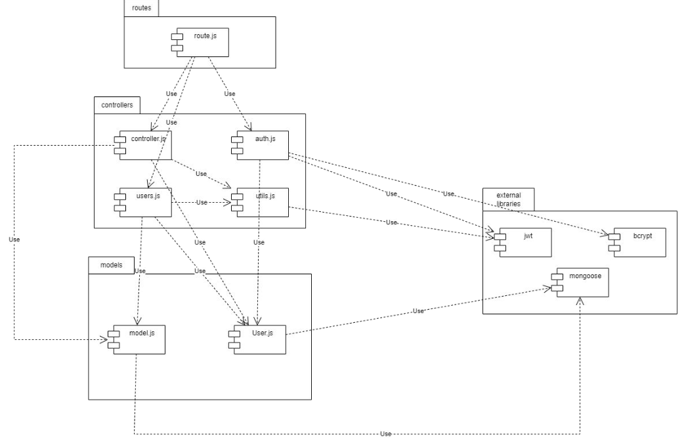

# Test Report

<The goal of this document is to explain how the application was tested, detailing how the test cases were defined and what they cover>

# Contents

- [Test Report](#test-report)
- [Contents](#contents)
- [Dependency graph](#dependency-graph)
- [Integration approach](#integration-approach)
- [Tests](#tests)
- [Coverage](#coverage)
  - [Coverage of FR](#coverage-of-fr)
  - [Coverage white box](#coverage-white-box)

# Dependency graph 

     
# Integration approach

    The integration approach adopted for testing the APIs in the project followed a mixed strategy, incorporating elements of both top-down and bottom-up testing. The integration sequence can be outlined as follows:

    Step 1: Unit Testing - Unit tests were written for individual components or units of the APIs. The purpose was to test the functionality of smaller units, such as functions or methods, in isolation.

    Step 2: Unit Integration - Once the individual units were tested and verified, they were integrated together, and integration tests were performed. This involved testing the interactions between different units to ensure seamless integration and expected outcomes.

    Step 3: API Testing - After the unit integration phase, the focus shifted to directly testing the API endpoints. Requests were sent to the APIs using various test cases, and the responses received were verified. The aim was to ensure that the APIs correctly processed the requests and provided the expected outputs.
    

# Tests

| Test case name | Object(s) tested | Test level | Technique used |
|----------------|------------------|------------|----------------|
|USERS|
|should retrieve list of all users|getUsers|Unit & Integration|Condition Coverage|
|should return 401 if not authorized|getUsers|Unit & Integration|Condition Coverage|
|should return an empty list if no users are found|getUsers|Unit & Integration|Condition Coverage|
|should return 500 if an error occurs|getUsers|Unit|Statement Coverage|
|should return the user with the given id|getUser|Unit & Integration|Condition Coverage|
|should return the user with the given id (admin case)|getUser|User|Decision Coverage|
|should return 401 if not authorized|getUser|Unit & Integration|Condition Coverage|
|should return 400 if no user is found|getUser|Unit & Integration|Condition Coverage|
|should return 500 if an error occurs|getUser|Unit|Statement Coverage|
|should create a new group|createGroup|Unit & Integration|Condition Coverage|
|should create a new group|createGroup|Unit|Decision Coverage|
|should return 401 if not authorized|createGroup|Unit & Integration|Condition Coverage|
|should return 400 if the request body does not contain all the necessary attributes|createGroup|Unit & Integration|Condition Coverage|
|should return 400 if the group name passed in the request body is an empty string|createGroup|Unit & Integration|Condition Coverage|
|should return 400 if the group name passed in the request body represents an already existing group in the database|createGroup|Unit & Integration|Condition Coverage|
|should return 400 if all the provided emails represent users that are already in a group or do not exist in the database|createGroup|Unit & Integration|Condition Coverage|
|should return 400 if the user who calls the API is already in a group|createGroup|Unit & Integration|Condition Coverage|
|should return 400 if at least one of the member emails is not in a valid email format|createGroup|Unit & Integration|Condition Coverage|
|should return 400 if at least one of the member emails is an empty string|createGroup|Unit & Integration|Condition Coverage|
|should return 500 if an error occurs|createGroup|Unit|Statement Coverage|
|should return all groups in the database|getGroups|Unit & Integration|Condition Coverage|
|should return 401 if the user is not authorized|getGroups|Unit & Integration|Condition Coverage|
|should return 500 if an error occurs|getGroups|Unit|Statement Coverage|
|should return the group requested|getGroup|Unit & Integration|Condition Coverage|
|should return the group requested (admin)|getGroup|Unit|Decision Coverage|
|should return 400 if the group name passed as route parameter does not represent a group in the database|getGroup|Unit & Integration|Condition Coverage|
|should return 401 if the user is not authorized|getGroup|Unit & Integration|Condition Coverage|
|should return 500 if an error occurs|getGroup|Unit|Statement Coverage|
|should add a user to a group (user)|addToGroup|Unit & Integration|Condition Coverage|
|should add a user to a group (admin)|addToGroup|Unit & Integration|Decision Coverage|
|shoukd return 400 if the request body does not contain all the necessary attributes|addToGroup|Unit & Integration|Condition Coverage|
|should return 400 if the group name passed as route parameter does not represent a group in the database|addToGroup|Unit & Integration|Condition Coverage|
|should return 400 if all the provided emails represent users that are already in a group or do not exist in the database|addToGroup|Unit & Integration|Condition Coverage|
|should return 400 if at least one of the member emails is not in a valid email format|addToGroup|Unit & Integration|Condition Coverage|
|should return 400 if at least one of the member emails is an empty string|addToGroup|Unit & Integration|Condition Coverage|
|should return 400 if at least one of the member emails is not in a valid email format (one email case)|addToGroup|Unit & Integration|Statement Coverage|
|should return 401 if called by an authenticated user who is not part of the group (authType = Group) if the route is api/groups/:name/add|addToGroup|Unit & Integration|Condition Coverage|
|should return 401 if called by an authenticated user who is not an admin (authType = Admin) if the route is api/groups/:name/insert|addToGroup|Unit & Integration|Condition Coverage|
|should return 500 if an error occurs|addToGroup|Unit|Statement Coverage|
|should remove the users passed in the body from the group passed in the params|removeFromGroup|Unit & Integration|Condition Coverage|
|should remove the users passed in the body from the group passed in the params|removeFromGroup|Unit|Decision Coverage|
|should remove the first email from the array before removing the users passed in the body from the group passed in the params|removeFromGroup|Unit|Condition Coverage|
|should return 401 if the route is not correct|removeFromGroup|Unit & Integration|Condition Coverage|
|should return 400 if the request body does not contain all the necessary attributes|removeFromGroup|Unit & Integration|Condition Coverage|
|should return 400 if the group name passed as a route parameter does not represent a group in the database|removeFromGroup|Unit & Integration|Condition Coverage|
|should return 400 if all the provided emails represent users that do not belong to the group or do not exist in the database|removeFromGroup|Unit & Integration|Condition Coverage|
|should return 400 if at least one of the emails is not in a valid email format|removeFromGroup|Unit & Integration|Condition Coverage|
|should return 400 if at least one of the emails is an empty string|removeFromGroup|Unit & Integration|Condition Coverage|
|should return 400 if the group contains only one member before deleting any user|removeFromGroup|Unit & Integration|Condition Coverage|
|should return 401 if called by an authenticated user who is not part of the group (authType = Group) if the route is api/groups/:name/remove|removeFromGroup|Unit & Integration|Condition Coverage|
|should return 401 if called by an authenticated user who is not an admin (authType = Admin) if the route is api/groups/:name/pull|removeFromGroup|Unit & Integration|Condition Coverage|
|should remove the first email from the array of emails|removeFromGroup|Unit|Statement Coverage|
|should return 500 if an error occurs|removeFromGroup|Unit|Statement Coverage|
|should delete the user and his transactions from the database and his email from all groups he is part of|deleteUser|Unit & Integration|Condition Coverage|
|should return a 400 error if the request body does not contain all the necessary attributes|deleteUser|Unit & Integration|Condition Coverage|
|should return a 400 error if the email passed in the request body is an empty string|deleteUser|Unit & Integration|Condition Coverage|
|should return a 400 error if the email passed in the request body is not in correct email format|deleteUser|Unit & Integration|Condition Coverage|
|should return a 400 error if the email passed in the request body does not represent a user in the database|deleteUser|Unit & Integration|Condition Coverage|
|should return a 400 error if the user to delete is an administrator (role Admin)|deleteUser|Unit & Integration|Condition Coverage|
|should return a 401 error if called by an authenticated user who is not an admin (authType = Admin)|deleteUser|Unit & Integration|Condition Coverage|
|should delete the group if the user to delete is the last member of the group|deleteUser|Unit & Integration|Condition Coverage|
|should return a 500 error if an error occurs|deleteUser|Unit|Statement Coverage|
|should delete the group|deleteGroup|Unit & Integration|Condition Coverage|
|should return a 400 error if the name passed in the request body does not represent a group in the database|deleteGroup|Unit & Integration|Condition Coverage|
|should return a 401 error if called by an authenticated user who is not an admin (authType = Admin)|deleteGroup|Unit & Integration|Condition Coverage|
|should return a 500 error if an error occurs|deleteGroup|Unit|Statement Coverage|
|UTILS|
|should return an empty object if no query parameters are provided|handleAmountFilterParams|Unit & Integration|Condition Coverage|
|should return a query object with $gte property if min query parameter is provided|handleAmountFilterParams|Unit & Integration|Condition Coverage|
|should return a query object with $lte property if max query parameter is provided|handleAmountFilterParams|Unit & Integration|Condition Coverage|
|should return an empty object if no query parameters are provided|handleDateFilterParams|Unit & Integration|Condition Coverage|
|should return a query object with $gte and $lte properties if date query parameter is provided|handleDateFilterParams|Unit & Integration|Condition Coverage|
|should return a query object with $gte property if from query parameter is provided|handleDateFilterParams|Unit & Integration|Condition Coverage|
|should return a query object with $lte property if upTo query parameter is provided|handleDateFilterParams|Unit & Integration|Condition Coverage|
|should return error when passing both date and from or date and upTo|handleDateFilterParams|Unit & Integration|Condition Coverage|
|should return error when passing both date and from|handleDateFilterParams|Unit|Condition Coverage|
|should return error when passing date, from and upTo|handleDateFilterParams|Unit|Condition Coverage|
|Tokens are both valid and belong to the requested user|verifyAuth|Unit & Integration|Condition Coverage|
|Tokens are both valid and belong to the requested group|verifyAuth|Integration|Condition Coverage|
|Tokens are both valid and belong to the requested admin|verifyAuth|Integration|Condition Coverage|
|Undefined tokens|verifyAuth|Unit & Integration|Condition Coverage|
|Access token expired and refresh token belonging to the requested user|verifyAuth|Condition Coverage|
|Access token and refresh token are both invalid|verifyAuth|Unit|Condition Coverage|
|Access token is missing information|verifyAuth|Unit & Integration|Condition Coverage|
|Refresh token is missing information|verifyAuth|Unit & Integration|Condition Coverage|
|Access token and refresh token mismatch|verifyAuth|Unit & Integration|Condition Coverage|
|Tokens are valid but belong to another user|verifyAuth|Unit & Integration|Condition Coverage|
|Tokens are valid but user is not an admin|verifyAuth|Unit & Integration|Condition Coverage|
|Tokens are valid but user belongs to another group|verifyAuth|Unit & Integration|Condition Coverage|
|Invalid auth type|verifyAuth|Unit & Integration|Condition Coverage|
|Auth type simple|verifyAuth|Unit|Condition Coverage|
|The user should perform login again|verifyAuth|Unit|Condition Coverage|
|Access token and refresh token are both invalid|verifyAuth|Unit|Condition Coverage|
|Both tokens are expired|verifyAuth|Integration|Condition Coverage|
|It is catched a 500 error|verifyAuth|Unit|Statement Coverage|
|CONTROLLER|
|should create a new category|createCategory|Unit & Integration|Condition Coverage|
|should return 400 if the request body does not contain all the necessary attributes|createCategory|Unit & Integration|Condition Coverage|
|should return 400 if at least one of the request body attributes is an empty string|createCategory|Unit & Integration|Condition Coverage|
|should return 400 if the type of category passed in the request body represents an already existing category in the database|createCategory|Unit & Integration|Condition Coverage|
|should return 401 if called by an authenticated user who is not an admin (authType = Admin)|createCategory|Unit & Integration|Condition Coverage|
|should return 500 if an error occurs|createCategory|Unit|Statement Coverage|
|should update a category|updateCategory|Unit & Integration|Condition Coverage|
|should return 400 if the request body does not contain all the necessary attributes|updateCategory|Unit & Integration|Condition Coverage|
|should return 400 if at least one of the parameters in the request body is an empty string|updateCategory|Unit & Integration|Condition Coverage|
|should return 400 if the type of category passed as a route parameter does not represent a category in the database|updateCategory|Unit & Integration|Condition Coverage|
|should return 400 if the type of category passed in the request body as the new type represents an already existing category in the database|updateCategory|Unit & Integration|Condition Coverage|
|should return 401 if called by an authenticated user who is not an admin (authType = Admin)|updateCategory|Unit & Integration|Condition Coverage|
|should return 500 if an error occurs|updateCategory|Unit|Statement Coverage|
|should delete a category (N > T)|deleteCategory|Unit & Integration|Condition Coverage|
|should delete a category (N = T)|deleteCategory|Unit & Integration|Condition Coverage|
|should return 400 if the request body does not contain all the necessary attributes|deleteCategory|Unit & Integration|Condition Coverage|
|should return 400 if called when there is only one category in the database|deleteCategory|Unit & Integration|Condition Coverage|
|should return 400 if at least one of the types in the array is an empty string|deleteCategory|Unit & Integration|Condition Coverage|
|should return 400 if at least one of the types in the array does not represent a category in the database|deleteCategory|Unit & Integration|Condition Coverage|
|should return 401 if if called by an authenticated user who is not an admin (authType = Admin)|deleteCategory|Unit & Integration|Condition Coverage|
|should return 500 if an error occurs|deleteCategory|Unit|Statement Coverage|
|should update a category|getCategories|Unit & Integration|Condition Coverage|
|should return 401 if called by a user who is not authenticated (authType = Simple)|getCategories|Unit & Integration|Condition Coverage|
|should return 500 if an error occurs|getCategories|Unit|Statement Coverage|
|should create a new transaction|createTransaction|Unit & Integration|Condition Coverage|
|should return 400 if the request body does not contain all the necessary attributes|createTransaction|Unit & Integration|Condition Coverage|
|should return 400 if at least one of the parameters in the request body is an empty string|createTransaction|Unit & Integration|Condition Coverage|
|should return 400 if the type of category passed in the request body does not represent a category in the database|createTransaction|Unit & Integration|Condition Coverage|
|should return 400 if the username passed in the request body is not equal to the one passed as a route parameter|createTransaction|Unit & Integration|Condition Coverage|
|should return 400 if the username passed in the request body does not represent a user in the database|createTransaction|Unit & Integration|Condition Coverage|
|should return 400 if the username passed as a route parameter does not represent a user in the database|createTransaction|Unit & Integration|Condition Coverage|
|should return 400 if the amount passed in the request body cannot be parsed as a floating value (negative numbers are accepted)|createTransaction|Unit & Integration|Condition Coverage|
|should return 401 if called by an authenticated user who is not the same user as the one in the route parameter (authType = User)|createTransaction|Unit & Integration|Condition Coverage|
|should return 500 if an error occurs|createTransaction|Unit|Statement Coverage|
|should get all transactions|getAllTransactions|Unit & Integration|Condition Coverage|
|should 400 if called by an authenticated user who is not an admin (authType = Admin)|getAllTransactions|Unit & Integration|Condition Coverage|
|should return 500 if an error occurs|getAllTransactions|Unit|Statement Coverage|
|should get all transactions by a specific user (ADMIN)|getTransactionsByUser|Unit & Integration|Condition Coverage|
|should return 401 if called by an authenticated user who is not an admin (authType = Admin) if the route is `/api/transactions/users/:username|getTransactionsByUser|Unit & Integration|Condition Coverage|
|should get all transactions by a specific user (USER)|getTransactionsByUser|Unit & Integration|Condition Coverage|
|should get all transactions by a specific user (USER), missing dateFormatted.date|getTransactionsByUser|Unit|Condition Coverage|
|should get all transactions by a specific user (USER), missing amountFormatted.amount|getTransactionsByUser|Unit|Condition Coverage|
|should return 401 if called by an authenticated user who is not an admin (authType = Admin) if the route is `/api/transactions/users/:username|getTransactionsByUser|Unit & Integration|Condition Coverage|
|should return 400 error if user is not found (ADMIN)|getTransactionsByUser|Unit|Condition Coverage|
|should return 400 error if user is not found (USER)|getTransactionsByUser|Unit|Condition Coverage|
|should return 401 if called by an user who is not the one for who the getTransaction is called (authType = User)|getTransactionsByUser|Integration|Condition Coverage|
|should return 500 if an error occurs|getTransactionsByUser|Unit|Statement Coverage|
|should get all transactions by a specific user and category (ADMIN)|getTransactionsByUserByCategory|Unit & Integration|Condition Coverage|
|should return 400 if the username passed as a route parameter does not represent a user in the database (ADMIN)|getTransactionsByUserByCategory|Unit & Integration|Condition Coverage|
|should return 400 if the category passed as a route parameter does not represent a category in the database (ADMIN)|getTransactionsByUserByCategory|Unit & Integration|Condition Coverage|
|should return 401 if called by an authenticated user who is not an admin (authType = Admin) if the route is reserved for admins|getTransactionsByUserByCategory|Unit & Integration|Condition Coverage|
|should return 401 if called by an authenticated user who is not the one in the route, if the route is reserved for users|getTransactionsByUserByCategory|Unit & Integration|Condition Coverage|
|should return 500 if an error occurs|getTransactionsByUserByCategory|Unit|Statement Coverage|
|should get all transactions by the members of a specific group (ADMIN)|getTransactionsByGroup|Unit & Integration|Condition Coverage|
|should return 400 if the group name passed as a route parameter does not represent a group in the database (ADMIN)|getTransactionsByGroup|Unit & Integration|Condition Coverage|
|should return 401 if called by an authenticated user who is not an admin (authType = Admin) and the route is reserved to admin|getTransactionsByGroup|Unit & Integration|Condition Coverage|
|should return 401 if called by an authenticated user who is not part of the group (authType = Group) if the route is the user one|getTransactionsByGroup|Unit & Integration|Condition Coverage|
|should return 500 if an error occurs|getTransactionsByGroup|Unit|Statement Coverage|
|should get all transactions by a specific group and category (ADMIN)|getTransactionsByGroupByCategory|Unit & Integration|Condition Coverage|
|should return 400 if the group name passed as a route parameter does not represent a group in the database (ADMIN)|getTransactionsByGroupByCategory|Unit & Integration|Condition Coverage|
|should return 400 if the category passed as a route parameter does not represent a category in the database (ADMIN)getTransactionsByGroupByCategory|Unit & Integration|Condition Coverage|
|should return 401 if called by an authenticated user who is not part of the group (authType = Group) if the route is for groups|getTransactionsByGroupByCategory|Unit & Integration|Condition Coverage|
|should return 401 if called by an authenticated user who is not the one in the route, if the route is reserved for users|getTransactionsByGroupByCategory|Unit & Integration|Condition Coverage|
|should return 500 if an error occurs|getTransactionsByGroupByCategory|Unit|Statement Coverage|
|should delete a transaction|deleteTransaction|Unit & Integration|Condition Coverage|
|should return 400 if the request body does not contain all the necessary attributes|deleteTransaction|Unit & Integration|Condition Coverage|
|should return 400 if the id in the body is an empty string|deleteTransaction|Unit & Integration|Condition Coverage|
|should return 400 if the username passed as a route parameter does not represent a user in the database|deleteTransaction|Unit & Integration|Condition Coverage|
|should return 400  if the _id in the request body does not represent a transaction in the database|deleteTransaction|Unit & Integration|Condition Coverage|
|should return 400  if the _id in the request body represents a transaction made by a different user than the one in the route|deleteTransaction|Unit & Integration|Condition Coverage|
|should return 401 if called by an authenticated user who is not the same user as the one in the route (authType = User)|deleteTransaction|Unit & Integration|Condition Coverage|
|should return 500 if an error occurs|deleteTransaction|Unit|Statement Coverage|
|should delete many transactions|deleteTransactions|Unit & Integration|Condition Coverage|
|should return 400 if the request body does not contain all the necessary attributes|deleteTransactions|Unit & Integration|Condition Coverage|
|should return 400 if at least one of the ids in the array is an empty string|deleteTransactions|Unit & Integration|Condition Coverage|
|should return 400 if at least one of the ids in the array does not represent a transaction in the database|deleteTransactions|Unit & Integration|Condition Coverage|
|should return 401 if called by an authenticated user who is not an admin (authType = Admin)|deleteTransactions|Unit & Integration|Condition Coverage|
|should return 500 if an error occurs|deleteTransactions|Unit|Statement Coverage|
|AUTH|
|should register a user|register|Unit & Integration|Condition Coverage|
|should return 400 if the request body does not contain all the necessary attributes|register|Unit & Integration|Condition Coverage|
|should return 400 if at least one of the parameters in the request body is an empty string|register|Unit & Integration|Condition Coverage|
|should return 400 if the email in the request body is not in a valid email format|register|Unit & Integration|Condition Coverage|
|should return 400 if the username in the request body identifies an already existing user|register|Unit & Integration|Condition Coverage|
|should return 400 if the email in the request body identifies an already existing user|register|Unit & Integration|Condition Coverage|
|should return 500 if an error occurs|register|Unit|Statement Coverage|
|should register an admin|registerAdmin|Unit & Integration|Condition Coverage|
|should return 400 if the request body does not contain all the necessary attributes|registerAdmin|Unit & Integration|Condition Coverage|
|should return 400 if at least one of the parameters in the request body is an empty string|registerAdmin|Unit & Integration|Condition Coverage|
|should return 400 if the email in the request body is not in a valid email format|registerAdmin|Unit & Integration|Condition Coverage|
|should return 400 if the username in the request body identifies an already existing user|registerAdmin|Unit & Integration|Condition Coverage|
|should return 400 if the email in the request body identifies an already existing user|registerAdmin|Unit & Integration|Condition Coverage|
|should return 500 if an error occurs|registerAdmin|Unit|Statement Coverage|
|should perform the login|login|Unit & Integration|Condition Coverage|
|should return 400 if the request body does not contain all the necessary attributes|login|Unit & Integration|Condition Coverage|
|should return 400 if at least one of the parameters in the request body is an empty string|login|Unit & Integration|Condition Coverage|
|should return 400 if the email in the request body is not in a valid email format|login|Unit & Integration|Condition Coverage|
|should return 400 if the email in the request body does not identify a user in the database|login|Unit & Integration|Condition Coverage|
|should return 400 if the supplied password does not match with the one in the database|login|Unit & Integration|Condition Coverage|
|should return 500 if an error occurs|login|Unit|Statement Coverage|
|should perform the logout|logout|Unit & Integration|Condition Coverage|
|should return 400 if the request does not have a refresh token in the cookies|logout|Unit & Integration|Condition Coverage|
|should return 400 if the refresh token in the request's cookies does not represent a user in the database|logout|Unit & Integration|Condition Coverage|
|should return 401 if not authorized|logout|Unit|Condition Coverage|
|should return 500 if an error occurs|logout|Unit|Statement Coverage|
# Coverage

## Coverage of FR
| Functional Requirements covered |   Test(s) | 
| ------------------------------- | ----------- | 
|  FR1  Manage users | auth.unit/integration.test, users.unit/integration.test |
| FR11  register| auth.unit/integration.test, suite: register  |
| FR12 login | auth.unit/integration.test, suite: login |
| FR13 logout | auth.unit/integration.test, suite: logout |
| FR14  registerAdmin | auth.unit/integration.test, suite: registerAdmin |
| FR15  getUsers | users.unit/integration.test, suite: getUsers  |
| FR16  getUser | users.unit/integration.test, suite: getUser |
| FR17  deleteUser | users.unit/integration.test, suite: deleteUser |
| FR2  Manage groups | ------------- |
| FR21  createGroup | users.unit/integration.test, suite: createGroup  |
| FR22 getGroups | users.unit/integration.test, suite: getGroups |
| FR23 getGroup | users.unit/integration.test, suite: getGroup |
| FR24 addToGroup | users.unit/integration.test, suite: addToGroup |
| FR26 removeFromGroup | users.unit/integration.test, suite: removeFromGroup |
| FR28 deleteGroup | users.unit/integration.test, suite: deleteGroup |
|  FR3  Manage  transactions| -------------|
| FR31 createTransaction| controller.unit/integration.test, suite: createTransaction |
| FR32 getAllTransactions | controller.unit/integration.test, suite: getAllTransactions |
| FR33 getTransactionsByUser  | controller.unit/integration.test, suite: getTransactionsByUser |
| FR34 getTransactionsByUserByCategory| controller.unit/integration.test, suite: getTransactionsByUserByCategory |
| FR35 getTransactionsByGroup | controller.unit/integration.test, suite: getTransactionsByGroup |
| FR36 getTransactionsByGroupByCategory | controller.unit/integration.test, suite: getTransactionsByGroupByCategory |
| FR37 deleteTransaction | controller.unit/integration.test, suite: deleteTransaction |
| FR38 deleteTransactions | controller.unit/integration.test, suite: deleteTransactions |
|  FR4 Manage categories | -------------|
| FR4  createCategory | controller.unit/integration.test, suite: createCategory |
| FR42 updateCategory | controller.unit/integration.test, suite: updateCategory |
| FR43 deleteCategory | controller.unit/integration.test, suite: deleteCategory |
| FR44  getCategories | controller.unit/integration.test, suite: GetCategories |

## Coverage white box

